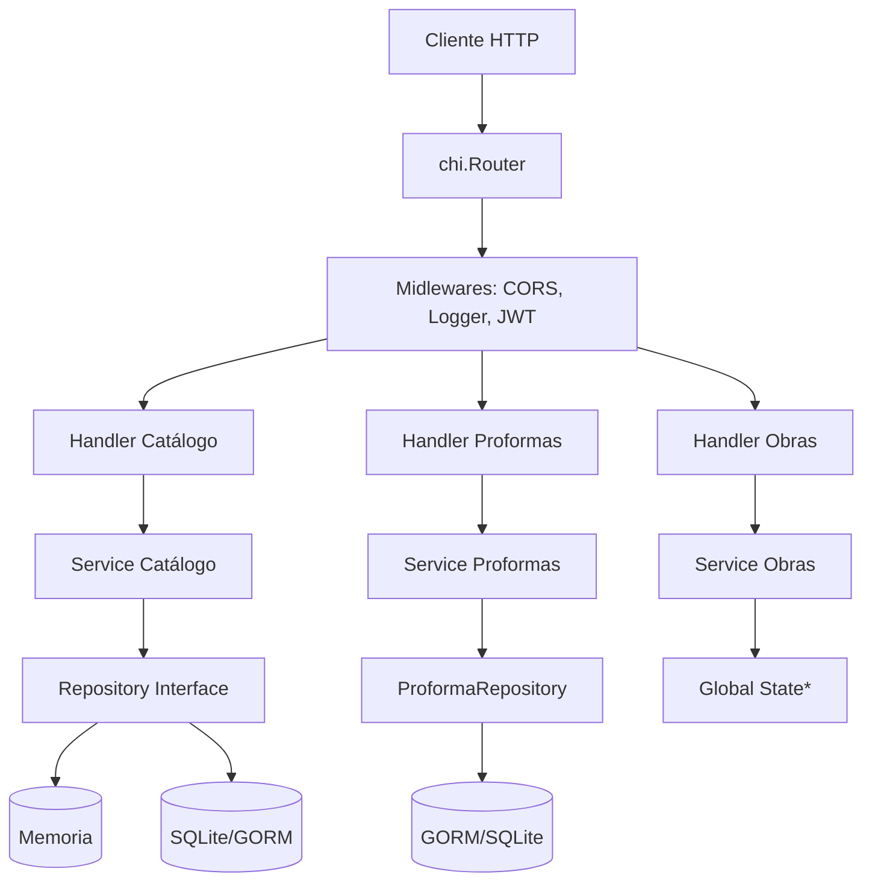

# Sistema de Gestión y Control de Obras — API Backend

API RESTful para la gestión de obras de construcción. Permite administrar catálogos de recursos (materiales, mano de obra, equipos), crear proformas con cálculo automático de costos, gestionar obras y registrar incidencias.

## Stack tecnológico

- **Lenguaje:** Go 1.24
- **Router:** Chi (`github.com/go-chi/chi/v5`)
- **ORM:** GORM (`gorm.io/gorm`)
- **Base de datos:** PostgreSQL 16 / SQLite
- **Autenticación:** JWT (HS256) con roles (admin, cliente)
- **Testing:** Testify (`github.com/stretchr/testify`)
- **Container:** Docker multi-stage + docker-compose

## Integrantes del equipo — Grupo D

| Integrante | Módulo | Responsabilidad |
|------------|--------|-----------------|
| Melani Molina | Módulo 1 — Catálogo | Materiales, Mano de Obra, Equipos, Precios |
| Franklin Molina | Módulo 2 — Proformas | Proformas, Clientes, Cálculo de costos |
| Carlos Bailón | Módulo 3 — Obras e Incidencias | Obras, Incidencias, Trazabilidad |

## Cómo levantar el proyecto

### Con Docker (recomendado)

```bash
docker compose up --build
```

Esto levanta:
- **PostgreSQL 16** en `localhost:5432`
- **API** en `http://localhost:3000`

### Sin Docker

```bash
cp .env.example .env  # si no existe
go run ./cmd/api/
```

Requiere Go 1.24+ y una instancia de PostgreSQL o editar `.env` para usar SQLite.

## Estructura del proyecto

```
.
├── cmd/api/main.go            ← Punto de entrada, DI, rutas
├── internal/
│   ├── config/                ← Configuración (variables de entorno)
│   ├── handlers/              ← Capa HTTP (handlers por módulo)
│   ├── services/              ← Capa de negocio (servicios)
│   ├── storage/               ← Capa de datos (repositorios, interfaces)
│   │   ├── memoria.go         ← Implementación en memoria
│   │   ├── sqlite.go          ← Implementación GORM/SQLite
│   │   └── factory.go         ← Fábrica de almacenamiento
│   ├── repository/            ← Repositorio GORM para Proformas
│   ├── middleware/            ← JWT, CORS, roles
│   ├── models/                ← Definiciones de entidades con tags GORM
│   ├── routes/                ← Registro de rutas (en desuso)
│   └── httpserver/            ← Configuración del servidor HTTP
├── db/                        ← Scripts SQL
├── postman/                   ← Colección Postman
├── Dockerfile                 ← Build multi-stage
├── docker-compose.yml         ← API + PostgreSQL
└── .github/workflows/ci.yml   ← Pipeline CI/CD
```

## Diagrama de arquitectura



## Endpoints por módulo

### Módulo 1 — Catálogo (Melani Molina)

| Método | Ruta | Descripción | Auth |
|--------|------|-------------|------|
| GET | `/api/v1/catalogo/material` | Listar materiales | JWT |
| GET | `/api/v1/catalogo/material/{id}` | Obtener material | JWT |
| POST | `/api/v1/catalogo/material` | Crear material | JWT |
| PUT | `/api/v1/catalogo/material/{id}` | Actualizar material | JWT |
| DELETE | `/api/v1/catalogo/material/{id}` | Eliminar material | JWT |
| GET | `/api/v1/catalogo/manoobra` | Listar mano de obra | JWT |
| GET | `/api/v1/catalogo/manoobra/{id}` | Obtener mano de obra | JWT |
| POST | `/api/v1/catalogo/manoobra` | Crear mano de obra | JWT |
| PUT | `/api/v1/catalogo/manoobra/{id}` | Actualizar mano de obra | JWT |
| DELETE | `/api/v1/catalogo/manoobra/{id}` | Eliminar mano de obra | JWT |
| GET | `/api/v1/catalogo/equipo` | Listar equipos | JWT |
| GET | `/api/v1/catalogo/equipo/{id}` | Obtener equipo | JWT |
| POST | `/api/v1/catalogo/equipo` | Crear equipo | JWT |
| PUT | `/api/v1/catalogo/equipo/{id}` | Actualizar equipo | JWT |
| DELETE | `/api/v1/catalogo/equipo/{id}` | Eliminar equipo | JWT |
| GET | `/api/v1/catalogo/precio` | Listar precios | JWT |
| POST | `/api/v1/catalogo/precio` | Crear precio | JWT |
| GET | `/api/v1/catalogo/precio/{tipo}/{id}/vigente` | Precio vigente | JWT |
| GET | `/api/v1/catalogo/precio/{tipo}/{id}` | Historial de precios | JWT |
| GET | `/api/v1/catalogo/precio/{id}` | Obtener precio | JWT |
| PUT | `/api/v1/catalogo/precio/{id}` | Actualizar precio | JWT |
| DELETE | `/api/v1/catalogo/precio/{id}` | Eliminar precio | JWT |

### Módulo 2 — Proformas (Franklin Molina)

| Método | Ruta | Descripción | Auth |
|--------|------|-------------|------|
| POST | `/api/v1/auth/register-proforma` | Registro de usuario | Público |
| POST | `/api/v1/auth/login-proforma` | Inicio de sesión | Público |
| POST | `/api/v1/proformas` | Crear proforma | JWT |
| GET | `/api/v1/proformas` | Listar proformas | JWT |
| GET | `/api/v1/proformas/{id}` | Obtener proforma | JWT |
| PUT | `/api/v1/proformas/{id}` | Actualizar proforma | JWT |
| DELETE | `/api/v1/proformas/{id}` | Eliminar proforma | JWT |
| POST | `/api/v1/proformas/{id}/items` | Agregar ítem | JWT |
| GET | `/api/v1/proformas/{id}/items` | Listar ítems | JWT |
| PUT | `/api/v1/proformas/{id}/aprobar` | Aprobar proforma | JWT |
| GET | `/api/v1/proformas/{id}/resumen` | Resumen de costos | JWT |
| POST | `/api/v1/proformas/{id}/notas` | Agregar nota | JWT |
| GET | `/api/v1/proformas/{id}/notas` | Listar notas | JWT |
| POST | `/api/v1/clientes` | Crear cliente | JWT |
| GET | `/api/v1/clientes` | Listar clientes | JWT |
| GET | `/api/v1/clientes/{id}` | Obtener cliente | JWT |
| PUT | `/api/v1/clientes/{id}` | Actualizar cliente | JWT |
| DELETE | `/api/v1/clientes/{id}` | Eliminar cliente | JWT |

### Módulo 3 — Obras e Incidencias (Carlos Bailón)

| Método | Ruta | Descripción | Auth |
|--------|------|-------------|------|
| POST | `/api/v1/obras` | Crear obra | JWT |
| GET | `/api/v1/obras` | Listar obras | JWT |
| GET | `/api/v1/obras/{id}` | Obtener obra | JWT |
| PUT | `/api/v1/obras/{id}` | Actualizar obra | JWT |
| DELETE | `/api/v1/obras/{id}` | Eliminar obra | JWT |
| POST | `/api/v1/incidencias` | Crear incidencia | JWT |
| GET | `/api/v1/incidencias` | Listar incidencias | JWT |
| GET | `/api/v1/incidencias/{id}` | Obtener incidencia | JWT |
| GET | `/api/v1/incidencias/por/{tipo}/{id}` | Incidencias por entidad | JWT |
| PUT | `/api/v1/incidencias/{id}` | Actualizar incidencia | JWT |
| DELETE | `/api/v1/incidencias/{id}` | Eliminar incidencia | JWT |

### Auth compartido

| Método | Ruta | Descripción |
|--------|------|-------------|
| POST | `/api/v1/auth/register` | Registro (Catálogo) |
| POST | `/api/v1/auth/login` | Login (Catálogo) |
| POST | `/api/v1/admin/register` | Crear usuario admin |
| POST | `/api/v1/auth/register-proforma` | Registro (Proformas) |
| POST | `/api/v1/auth/login-proforma` | Login (Proformas) |

## Variables de entorno

| Variable | Default | Descripción |
|----------|---------|-------------|
| `PORT` | `:8080` | Puerto del servidor |
| `DB_DRIVER` | `sqlite` | Driver de BD (`sqlite` o `postgres`) |
| `DB_DSN` | `proforma.db` | Cadena de conexión |
| `JWT_SECRETO` | (default) | Secreto para firmar JWT |
| `JWT_DURACION` | `24h` | Duración del token |

## Ejecutar tests

```bash
go test -v ./...
```

## CI/CD

El pipeline de GitHub Actions ejecuta `build → vet → test` en cada push/PR a `main`.

Ver: `.github/workflows/ci.yml`

## Licencia

Proyecto académico — TDI-601 Aplicaciones Web II · ULEAM · 2026-1
